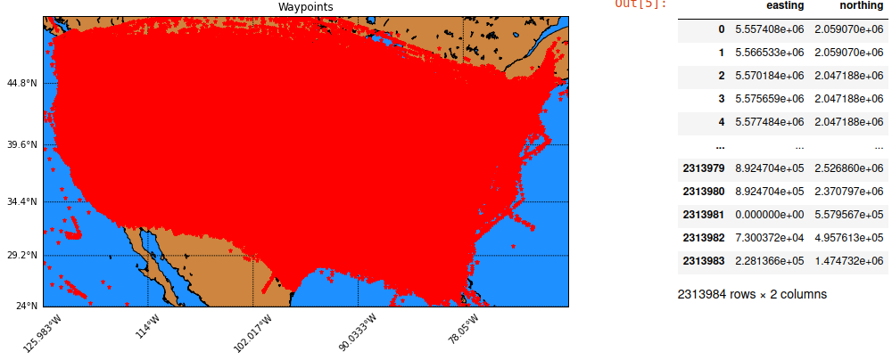
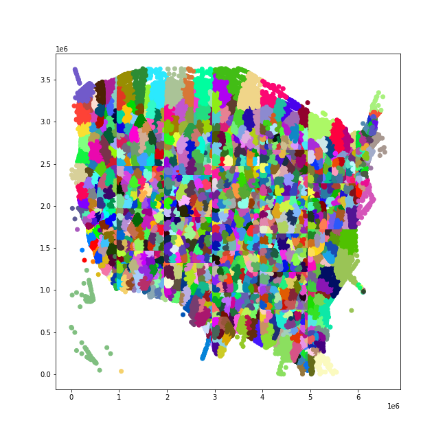
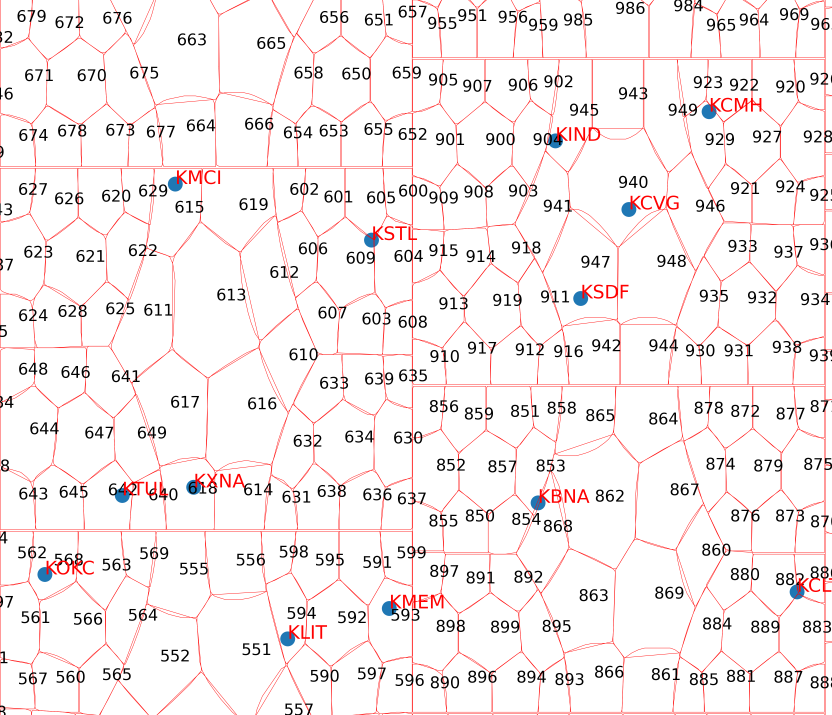

<h1> Air Traffic Distribution </h1>
Capstone project done as a part of the requirements for the bachelors degree in CS at PES University (2019 - 23) guided by Dr. Preethi P.

  
Contributors
 <table align="center">
    <tr> 
      <th> Name </th>
      <th> SRN </th>
    </tr>
    <tr>
      <td> Rahul Rampure </td>
      <td> PES1UG19CS370 </td>
    </tr>
    <tr>
      <td> Raghav Tiruvallur </td>
      <td> PES1UG19CS362 </td>
    </tr>
    <tr>
      <td> Vybhav Acharya </td>
      <td> PES1UG19CS584 </td>
    </tr>
    <tr>
      <td> Shashank Navad </td>
      <td> PES1UG19CS601 </td>
    </tr>
    </table>

 
&emsp;The main idea that is being presented here is a game theoretic approach to obtain a solution to the Air Traffic Management Problem (ATMP) by means of a GPU Accelerated Genetic algorithm. The general flow of the program can be modularized as follows:
  
<h2> Pre-Processing and Sectorizing - Python </h2>
<ol type = "1">
 <li> We use a file provided in the dataset for the GE Flight Quest 2 Kaggle Competition -> Waypoints.csv. This file contains all the Airspace Waypoints/Fixes traversed by all flights over a period of one month in the year 2013. We drop all duplicate fixes and convert the spherical coordinates of each fix to cartesian coordinates, thereby allowing the fixes to be projected on a 2D map of USA.</li>
    

      
    

    <li>We then apply Spectral Clustering on these 2D fixes to obtain 1250 clusters and around each cluster we form a convex hull, to create a sprawl of 1250 convex hulls. These hulls are connected to form a weighted graph with edge weights set to inter-centroid distance of two adjacent hulls with the vertices being the hulls themselves. The hulls thus represent geographical zones (in the airspace) and the graph is hence a zonal traffic network. There are a total of 1250 vertices and 3610 weighted directed edges in this graph/traffic network.</li>
    

      
      
    

</ol>
<h2> GPU-Accelerated Genetic Algorithm - CUDA, C </h2>
<ol type = "1">
  <li> Modified the sequential genetic algorithm delineated in <a href="https://ieeexplore.ieee.org/abstract/document/1134124"> this research paper to find the shortest path between two vertices in a static graph</a>, to find the "fittest path" in a multi-commodity graph which takes into account the traffic expected in the route, the total angle deviation suffered etc. and also takes into account the concept of "ground - holding" wherein the aircraft could just delay itself on the ground for some time (with some linear cost penalty), if doing so would allow it to take off at a later time, when the expected air-traffic congestion is lesser. Hence the fitness of the chromosome is time-varying.  </li>
  <li> The Pure Strategy Nash Equilibrium of the congestion game so formed is then approximated by using the custom GA developed to obtain "best response strategy" for each Nth player/aircraft provided the (N-1) players/aircraft have chosen their strategies already. This best response dynamic has been proved to converge to a locally optimal approximation of PSNE <a href="/www.sciencedirect.com/science/article/abs/pii/S0899825696900445"> in this article</a>. Since the problem of finding the actual PSNE startegy profile is PLS - Complete, it will be impossible to find the globally optimal solution in polynomial time </li>
  <li> We have parallelized the custom GA developed to run entirely on the GPU to aid in faster computation of the strategy profile which is an approximation of the PSNE.</li>
  </ol>
  <h2> Website - MERN Stack </h2>
  Raghav Boss you doing this
   

