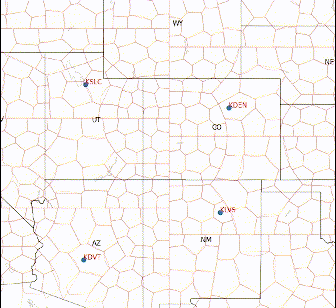
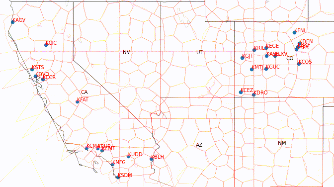
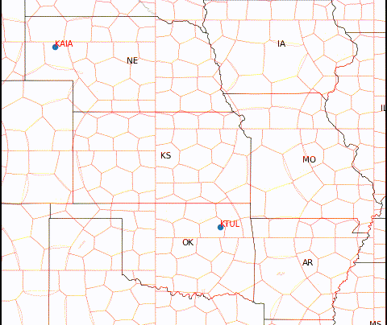

[](https://github.com/CascadingRadium/Air-Traffic-Distribution/network)
[](https://github.com/CascadingRadium/Air-Traffic-Distribution/stargazers)
[](https://github.com/CascadingRadium/Air-Traffic-Distribution/issues)


<h1> Air Traffic Distribution </h1>
<p align="justify">Capstone project done as a part of the requirements for the bachelors degree in CS at PES University (2019 - 23) guided by Dr. Preethi P.</p>
<p>
  <h3 align="center"> Contributors </h3> 
  <table align="center">
    <tr> 
      <th> Name </th>
      <th> SRN </th>
    </tr>
    <tr>
      <td> Rahul Rampure </td>
      <td> PES1UG19CS370 </td>
    </tr>
    <tr>
      <td> Raghav Tiruvallur </td>
      <td> PES1UG19CS362 </td>
    </tr>
    <tr>
      <td> Vybhav Acharya </td>
      <td> PES1UG19CS584 </td>
    </tr>
    <tr>
      <td> Shashank Navad </td>
      <td> PES1UG19CS601 </td>
    </tr>
    </table>
</p>
<h2 align="center">Abstract</h2>
<ul align="justify">
<li>This proposal introduces a Genetic Algorithm implemented in CUDA and C that enables a flight dispatcher to generate flight plans based on a schedule containing prospective flights. The schedule includes details such as departure and arrival airports, scheduled departure time, and cruise speed for each flight.</li>
<li>By utilizing this algorithm, flight paths are generated for each aircraft with the goal of minimizing mid-air traffic, thereby reducing air traffic congestion. The algorithm takes into account the dynamic position of the airplane over time and ensures that the number of nearby aircraft remains minimal throughout the flight.</li>
<li>Additionally, the algorithm considers the possibility of introducing slight delays to aircraft departures. This strategy aims to create shorter routes with less en-route traffic. A comparison is made between the benefits of this approach and longer routes that avoid most of the traffic.</li>
<li>A constraint is imposed on the algorithm, requiring that both the departure and arrival airports have at least one available runway for the aircraft to use at the specified times. This constraint effectively establishes a mapping between aircraft and runways at the respective airports.</li>
<li>Consequently, the flight dispatcher receives the actual departure times for each flight, accounting for any delays, as well as the optimal routes for each aircraft. To facilitate this process, an interactive website has been developed, allowing the dispatcher to input/upload the schedule and execute the algorithm with a simple click. Furthermore, a Python simulator has been created to visualize the aircraft positions along their paths over time.</li>
</ul>
<h2 align="center">System Requirements, Execution and Evaluation</h2>
<p align="justify"> The following set of requirements must be satisfied by the execution environment before the repository is cloned.</p>
<ul align="justify">
<li> Linux-based OS (Windows/WSL not supported).</li>
<li> CUDA enabled GPU.<a href="https://developer.nvidia.com/cuda-gpus"> Check if your GPU is CUDA-enabled. </a></li>
<li> NodeJS (Version > 18) <a href="https://nodejs.org/en/download/"> Download NodeJS.</a></li>
<li> Nvidia CUDA Compiler (NVCC) <a href="https://developer.nvidia.com/cuda-downloads?target_os=Linux"> Download NVCC.</a></li>
<li> Python (Version > 3.8) </li>
<li> Git and Git LFS  <code>sudo apt-get install git git-lfs</code> </li> 
</ul>
<p align="justify"> To execute the project, one needs to run the shell script “runWebsite.sh” provided in the root. The shell script will perform a first-time setup and launch the website. The user can input or upload a flight schedule, execute the algorithm to obtain the solution, and simulate the same using the buttons provided.</p>  

```
sudo chmod +x runWebsite.sh
./runWebsite.sh
```

The video below shows the website in use:

https://user-images.githubusercontent.com/53022689/207081997-caba21ec-5c32-49b5-b5d3-af1a7a801299.mp4
<p align ="justify">
The Python-based simulator generates visual representations of traffic distribution for different test scenarios. The accompanying GIFs below illustrate these scenarios. Each aircraft is assigned a distinct color, while the airports are depicted in blue. The GIFs reveal that the airplanes are dispersed throughout the airspace, maintaining significant distances between each other. Notably, queues of aircraft can be observed forming near the airports, replicating real-world situations.
</p>
<p float="left">
  
  
  
  
</p>

<p align="justify"> 
In order to evaluate the project, the provided shell script "runEvaluator.sh" should be executed from the root directory. This script generates a flight schedule that can be uploaded to the project's website. The flight schedule is derived from ASDI (Aircraft Situation Display to Industry) data, specifically for the period of August 16-19, 2013. The script prompts the user for input and provides numerical values indicating the benefits of the project's solution compared to the existing Air Traffic Management system currently deployed in the USA. Additionally, relevant charts and heatmaps are generated and stored in the OutputImages folder. The execution of the code has been performed using flight schedules obtained from the tested dates, and the corresponding output can be found in the Results Folder.
</p>  

```
sudo chmod +x runEvaluator.sh 
./runEvaluator.sh [DATE OPTION] [NUMBER OF FLIGHTS OPTION]

[DATE OPTION] = [2013-08-16 | 2013-08-17 | 2013-08-18 | 2013-08-19]  // Date to evaluate for
[NUMBER OF FLIGHTS OPTION] = [-1 | X]  // -1 for the complete flight schedule or X for a truncated schedule with X flights  
```
<h2 align="center">Cite our work</h2>
<p align="justify"> 
Published in <a href = "https://doi.org/10.2478/ttj-2023-0021">Transport and Telecommunication Journal, Vol. 24, Issue 3 (June 2023)</a>. To cite our work, use the following </p>  

  ```
  Rampure,R.,Tiruvallur,R.,Acharya,V.,Navad,S. & Preethi,P.(2023).
  Air Traffic Management Using a GPU-Accelerated Genetic Algorithm.
  Transport and Telecommunication Journal,24(3) 266-277.
  https://doi.org/10.2478/ttj-2023-0021
  ```


